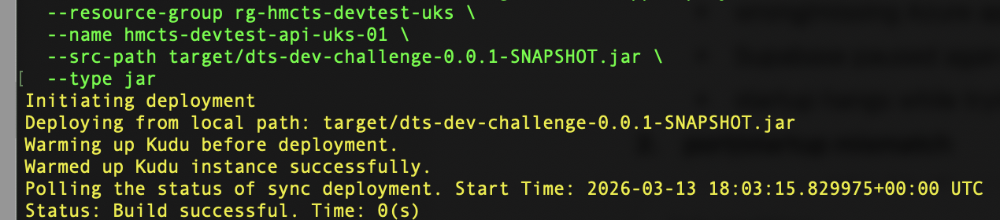
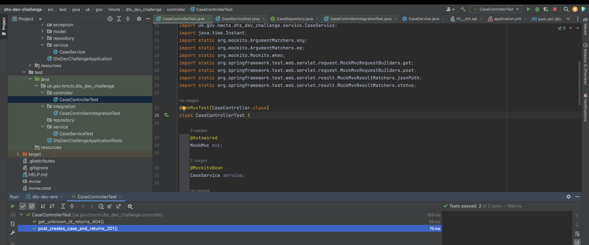
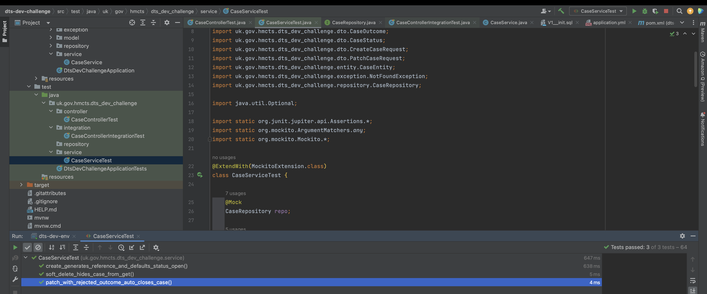
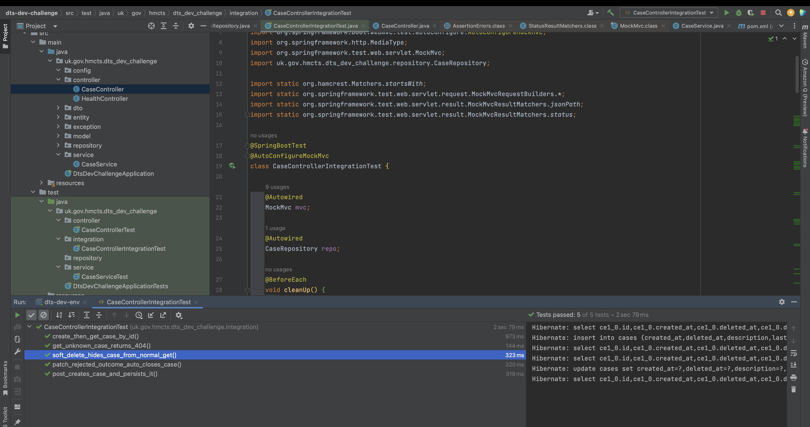
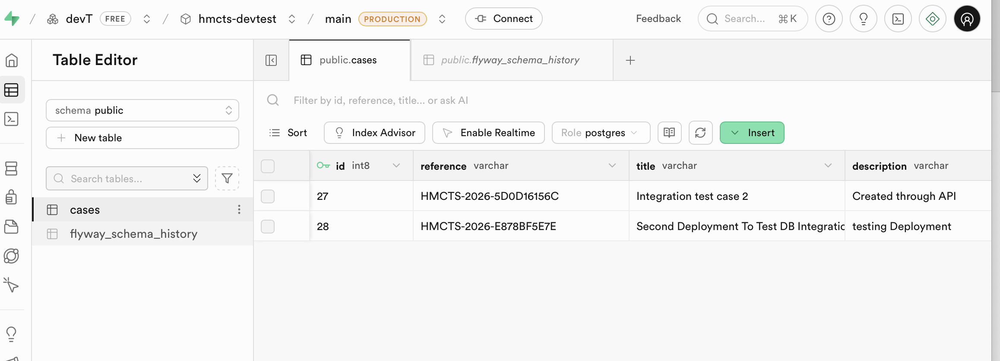
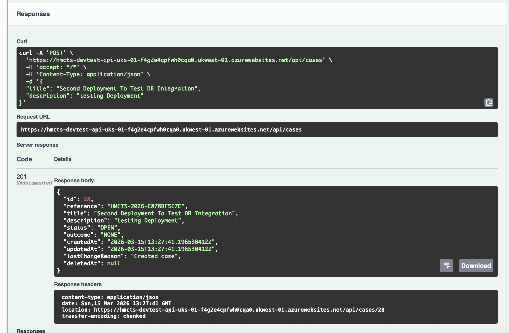
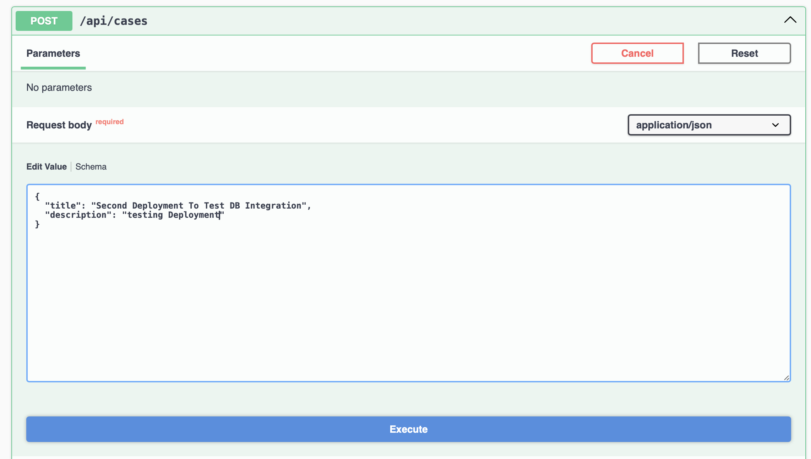
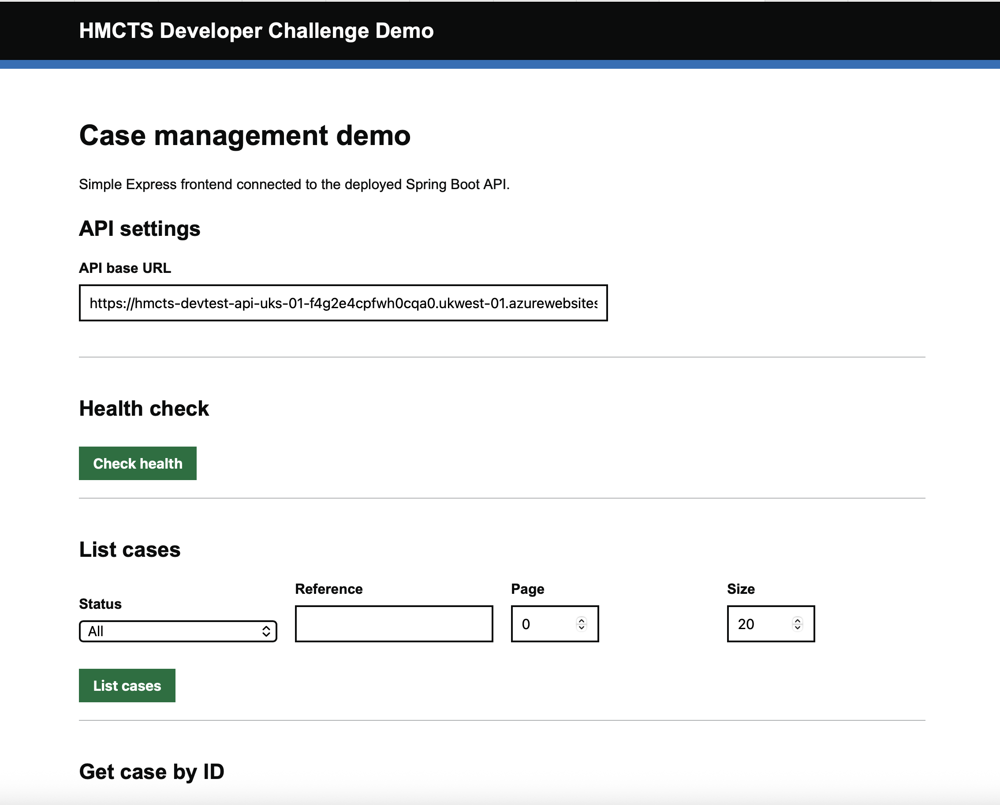

# HMCTS DTS Developer Challenge Submission

## Overview

This repository contains my submission for the HMCTS DTS Developer Challenge.

The solution implements a simple case management API using Java 17 and Spring Boot, following a layered structure with controller, service, repository, DTO, and entity separation. The aim was to produce a clear, maintainable and testable backend service that demonstrates core software engineering practices including API design, database integration, testing, configuration management and deployment readiness.

This submission was developed with a focus on clean structure, separation of concerns, testability, and practical deployment to a cloud-hosted environment.

## Tech Stack

- Java 17
- Spring Boot
- Maven
- Spring Web
- Spring Data JPA
- PostgreSQL
- Flyway
- JUnit / Mockito
- Swagger / OpenAPI
- Azure App Service
- Supabase PostgreSQL

## Solution Structure

The application follows a standard layered architecture:

- **Controller layer** – exposes REST endpoints
- **Service layer** – contains business logic
- **Repository layer** – handles database access
- **DTO layer** – separates API contracts from persistence models
- **Entity layer** – maps application data to the database

This structure was chosen to keep responsibilities separated and to make the application easier to test and extend.

## Features

The API supports core case management functionality, including:

- creating a case
- retrieving all cases
- retrieving a case by ID
- updating a case
- deleting a case

## API Endpoints

Example endpoints used in the application:

- `GET /cases`
- `GET /cases/{id}`
- `POST /cases`
- `PUT /cases/{id}`
- `DELETE /cases/{id}`

## Example Request

### Create a case

```json
{
  "reference": "CASE-1001",
  "title": "Example case",
  "description": "Sample case description",
  "status": "OPEN"
}
```

## Example Response

```json
{
  "id": 1,
  "reference": "CASE-1001",
  "title": "Example case",
  "description": "Sample case description",
  "status": "OPEN"
}
```

## How to Run Locally

### Prerequisites

To run the application locally, the following are required:

- Java 17
- Maven
- PostgreSQL database
- environment variables for database connectivity

### Environment Variables

The application is configured to use environment variables rather than hard-coded credentials.

Typical variables include:

- `DB_URL`
- `DB_USERNAME`
- `DB_PASSWORD`

### Build the Application

```bash
mvn clean install
```

### Run the Application

```bash
mvn spring-boot:run
```

Once running locally, the API is typically available on:

```text
http://localhost:8080
```

## Running Tests

Run the test suite with:

```bash
mvn test
```

The project includes tests covering core functionality across the application layers.

## API Documentation

Swagger / OpenAPI is enabled to support quick inspection and testing of the API.

When running locally, Swagger UI can be accessed at:

```text
http://localhost:8080/swagger-ui/index.html
```

## Health Endpoint

The application also exposes a Spring Boot Actuator health endpoint:

```text
http://localhost:8080/actuator/health
```

## Database and Configuration

The application uses PostgreSQL for persistence.

Database schema management is handled with Flyway migrations. Configuration is externalised through environment variables to support local development and cloud deployment without embedding secrets in the repository.

The project has been structured so that configuration can be changed between environments without requiring code changes.

## Deployment Notes

The application was prepared for deployment to Azure App Service and connected to a PostgreSQL database.

At the time of submission:

- the project built successfully with Maven
- an updated JAR was produced and uploaded manually to Azure App Service
- deployment activity was completed against an Azure-hosted instance
- the application was configured with actuator and Swagger endpoints
- live re-validation after the latest deployment was constrained by Azure free-tier CPU quota limits at submission time

### Hosted Backend URL

```text
https://hmcts-devtest-api-uks-01-f4g2e4cpfwh0cqa0.ukwest-01.azurewebsites.net
```

### Hosted Endpoints

- Health endpoint:  
  `https://hmcts-devtest-api-uks-01-f4g2e4cpfwh0cqa0.ukwest-01.azurewebsites.net/actuator/health`

- Swagger UI:  
  `https://hmcts-devtest-api-uks-01-f4g2e4cpfwh0cqa0.ukwest-01.azurewebsites.net/swagger-ui/index.html#/`

## Frontend / Local Client

A local frontend or client instance was used during development and integration testing on:

```text
http://localhost:3000
```

This URL is for local development only and is not publicly hosted.

## Screenshots

Evidence of build, deployment, database integration, API validation, and local frontend testing is included in:

```text
docs/screenshots/
```

### Included Screenshots

















## Assumptions

The following assumptions were made while completing the challenge:

- a relational database-backed case management API was an appropriate interpretation of the challenge requirements
- environment-based configuration is preferable to hard-coded secrets
- maintainability, clarity, and testability were prioritised alongside implementation
- a lightweight but production-structured backend service was an appropriate submission format

## Design Decisions

A layered architecture was used to ensure that responsibilities are clearly separated across the application.

DTOs were used to avoid exposing persistence models directly through the API.

Flyway was included to support repeatable and controlled database schema management.

Environment variable-based configuration was used to reduce the risk of committing secrets and to simplify deployment between local and cloud environments.

Swagger was enabled to improve discoverability and make endpoint testing easier.

## Future Improvements

Given more time, the following improvements would be added:

- stronger request validation
- more detailed exception handling and standardised error responses
- broader integration test coverage
- CI/CD pipeline automation
- improved observability and monitoring
- stronger deployment verification in the hosted environment
- role-based security and authentication where appropriate
- pagination and filtering for collection endpoints

## Repository Notes

This repository has been kept name-blind for submission purposes.

No personal identifying information has been intentionally included in the repository contents.

## Summary

This submission demonstrates a Java Spring Boot case management API with:

- a layered design
- database integration
- migration support
- test coverage
- API documentation
- deployment preparation for Azure App Service

The main focus has been on producing a clean, maintainable and extensible solution that reflects good backend engineering practice.